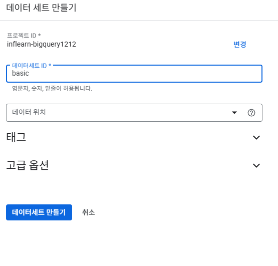
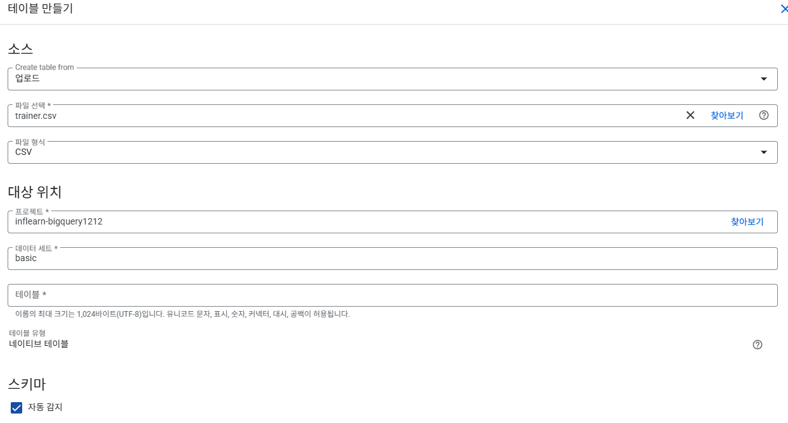

# SQL_BASIC 1주차 정규 과제 

📌SQL_BASIC 정규과제는 매주 정해진 분량의 `초보자를 위한 BigQuery(SQL) 입문` 강의를 듣고 간단한 문제를 풀면서 학습하는 것입니다. 이번주는 아래의 **SQL_Basic_1st_TIL**에 나열된 분량을 수강하고 `학습 목표`에 맞게 공부하시면 됩니다.

**👀(수행 인증샷은 필수입니다.)** 

## SQL_BASIC_1st_TIL

### 섹션 2. BigQuery 기초 지식

### 1-1. BigQuery 기초 지식

### 1-2. BigQuery 환경 설정

## 섹션 3. 데이터 탐색 - 조건, 추출, 요약

### 2-1. 데이터 활용 Overview 

### 2-2. 저장된 데이터 확인하기

## 🏁 강의 수강 (Study Schedule)

| 주차  | 공부 범위              | 완료 여부 |
| ----- | ---------------------- | --------- |
| 1주차 | 섹션 **1-1** ~ **2-2** | ✅         |
| 2주차 | 섹션 **2-3** ~ **2-5** | 🍽️         |
| 3주차 | 섹션 **2-6** ~ **3-3** | 🍽️         |
| 4주차 | 섹션 **3-4** ~ **4-4** | 🍽️         |
| 5주차 | 섹션 **4-4** ~ **4-9** | 🍽️         |
| 6주차 | 섹션 **5-1** ~ **5-7** | 🍽️         |
| 7주차 | 섹션 **6-1** ~ **6-6** | 🍽️         |

 

<!-- 여기까진 그대로 둬 주세요-->

---

# 1️⃣ 개념정리 
<!-- 강의 수강 이후에 아래의 학습 목표에 맞게 개념을 자유롭게 정리해주세요.-->
## 1-1. BigQuery 기본지식

~~~
✅ 학습 목표 :
* 데이터 관련 기초 지식(OLTP, SQL, Row, Column, 저장 형태 등)을 설명할 수 있다. 
* BigQuery 관련 기초 지식에 대해서 파악할 수 있다. 
~~~

### BigQuery 기초 지식

#### 데이터 저장 형태
데이터는 보통 데이터베이스 테이블 등에 저장
- Database: 데이터의 저장소
- Table: 데이터가 저장된 공간
- 저장된 데이터를 앱, 웹에서 사용

MySQL, Oracle 과 같은 데이터베이스에 주로 저장

#### OLTP
거래를 하기 위해 사용되는 데이터베이스
분석을 위해 만든 데이터베이스가 아니라 쿼리 속도가 느릴 수 있음

#### SQL
데이터베이스에서 데이터를 가지고 올 때 사용하는 프로그래밍 언어. 쿼리문 작성

#### 테이블 구조
행(Row) / 열(Column)
테이블에 저장된 형태 = 엑셀, 스프레드시트와 유사

#### OLAP: 속도, 기능 부족 개선을 위해 등장
-분석을 위한 기능 제공

#### 데이터 웨어하우스
-데이터를 한곳에 저장

#### BigQuery 장점

SQL을 사용해 쉽게 데이터 추출 가능
OLAP도구이므로 속도가 매우 빠름
Firebase, Google Analytics 4의 데이터를 쉽게 추출 가능
구글이 인프라를 관리하기 때문에 서버(컴퓨터)를 띄울 필요 없음
적은 비용으로도 진행 가능

#### BigQuery 비용(US기준)

쿼리 비용: 
- on-demand 요금제: 처리된 용량만큼 부과 
- Capacity 요금제: slot단위로 요금 부과 

저장 비용: Active Logical 저장소, Long-term Logical 저장소

### BigQuery 환경 설정

1) 프로젝트: 하나의 프로젝트에 여러 데이터셋 존재 가능
2) 데이터셋: 프로젝트에 있는 창고. 각 창고 공간에 데이터를 제정
3) 테이블 : 테이블 안엔 행, 열로 이루어진 데이터들이 저장(상품의 세부 정보가 저장)

## 2-1. 데이터 활용 Overview

~~~
✅ 학습 목표 :
* 데이터를 활용하는 과정을 설명할 수 있다.
* 데이터를 탐색하는 과정으로 조건과 추출, 요약을 할 수 있다. 
~~~

### 데이터 활용 과정

문제 정의-> 데이터를 탐색-> 다량의 자료를 연결-> 조건/추출/변환/요약
-> 데이터 결과 검증(예상과 실제가 동일한가)-> 피드백/활용

데이터 탐색, 데이터 결과 검증에서 SQL을 사용

단일 자료 가정하고 여기서 어떻게 조건(필터링)하고 추출할지...

## 2-2. 저장된 데이터 활용하기

~~~
✅ 학습 목표 :
* 데이터가 저장되는 형태를 알고 저장된 데이터를 활용할 수 있다. 
~~~

쿼리 작성 전: 데이터가 어떻게 저장? 어떤 데이터? 컬럼의 의미는? 를 파악할 것
데이터를 제대로 이해해야 함

### 데이터 저장 형태를 알기 위해선:

ERD를 통해 데이터베이스 구조 한눈에 알아보기
ex. Product - Order - Customer

ERD가 없다면, 모든 데이터베이스를 직접보면서 탐색해봐야함
어떤 테이블이 존재하는지, 어떤 컬럼이 존재하는지, 다른 테이블과 연결할 때 어떤 컬럼을 사용하는지
컬럼의 값들은 어떤 의미를 가지는지

### 데이터의 예시

서비스에 사용될 데이터베이스: 유저 테이블, 배송 테이블, 물건 테이블
앱/웹 로그 데이터: 과정을 알 수 있는 데이터
공공 데이터, 서드파티 데이터: 날씨, 페이스북 광고 데이터

#### 포켓몬 세상을 데이터로 생각해보기

포켓몬 세상의 데이터: 포켓몬, 트레이너, 트레이너가 잡은 포켓몬, 배틀, 상점, NPC

#### 이커머스 산업의 데이터로 생각해보기

이커머스의 데이터: 상품, 유저, 주문, 장바구니에 담은 물건, 웹페이지 접근 수

### 포켓몬 데이터 BigQuery에서 확인하기

저장된 데이터 확인하면서 데이터 정리 및 ERD 그리기

ex. 포켓몬 타입, 포켓몬 레벨, 경험치 포인트, 언제 잡았는지 등등의 컬럼 확인
어떤 컬럼이 연결되는지 확인(여기선 id)
Pokemon - Trainer_Pokemon - Trainer 

---
# 2️⃣ 학습 인증란

 
 

---

# 3️⃣ 확인문제

## 문제 1

> **🧚Q. 포켓몬 게임이나 이커머스 산업과 같이 다양한 산업에서는 각기 다른 데이터가 존재합니다. 다음 중 하나의 산업을 선택하고, 해당 산업에서 수집하고 활용될 수 있는 데이터 항목 (칼럼) 5가지를 자유롭게 상상하여 나열해보세요.**
>
> - 예시 산업 
>
> >  온라인 음식 배달 / 스마트 헬스 케어 / 중고 거래 앱 / 교육 플랫폼 등 

<!--현실과 데이터 분석의 연결 고리를 상상하고, 데이터를 저장하는 형태를 활용하는 문제입니다. -->

<!--학습한 개념을 활용하여 자유롭게 설명해 보세요. 구체적인 예시를 들어 설명하면 더욱 좋습니다.-->

~~~
온라인 음식 배달을 유저 테이블, 배송 테이블, 물건 테이블로 분리하여 설계해 볼 수 있다. 
유저 테이블의 컬럼으로는 유저 id, 고객 이름, 사는 도시, 연령, 연락처, 멤버십 등급, 이메일 주소, 가입 일자
배송 테이블의 컬럼으로는 배송 고유 번호, 배송 상태, 배송 시간, 배송비, 담당 배달 기사, 한 집배달 여부
물건 테이블의 칼럼으로는 상품 고유 번호, 상품명, 음식 카테고리. 가격, 판매량
또한 앱/웹 로그 데이터도 다뤄볼 수 있는데, 그 컬럼으로는 클릭 수, 일주일 동안 로그인 수, 앱 로그 지속 시간, 클릭 수

유저테이블의 유저 id가 배송테이블의 유저 id 와 연결되면서 이 배송은 어떤 특성을 가진 유저의 것인가?라는 연결이 생긴다. 
혹은 물건 테이블의 상품 고유 번호가 배송 테이블의 상품 번호로 연결되면서 이 배송은 어떤 물건을 배달하는 건가?라는 연결이 생긴다.

~~~

## 문제 2

> **🧚Q. 이번 강의를 통해 SQL이 왜 필요하다고 느끼는지, SQL을 통해 본인이 어떤 것을 해내고 싶은지를 자유롭게 작성해보세요.**

~~~
실제 서비스 환경에서 유저가 왜 특정 시점에서 서비스를 이탈했는지, 어떤 부분에서 불편함을 느껴 개선을 필요로 한건지를 파악하려면 흩어져있는 다량의 자료들을 하나로 연결하는 과정이 필요하다. 
SQL은 복잡하게 퍼져있는 이러한 정보들을 필터링하고 추출하여 결합함으로써 데이터 이면의 정보를 보여준다. 
이렇게 대량의 데이터 사이에서 쿼리를 통해 결과를 내는 것은 정보로 흘러넘치는 현대 사회에서 가장 중요한 능력이라고 할 수 있다. 

현대 사회에서 어떤 콘텐츠가 흥행할지 예측하는 것은 매우 어렵다. 
하지만 SQL을 통해 유저의 체류 시간, 재방문률, 특정 구간 반복 패턴 등을 추출하여 엔터테인먼트 산업의 지속 가능한 성장을 이끌어내고 싶다. 데이터 속에서 담긴 유저의 심리를 파악하여 맞춤 콘텐츠와 최적의 시청 경험을 설계함으로써 서비스의 가치를 극대화할 것이다.
~~~

### 🎉 수고하셨습니다.

