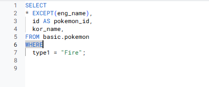

# SQL_BASIC 2주차 정규 과제 

📌SQL_BASIC 정규과제는 매주 정해진 분량의 `초보자를 위한 BigQuery(SQL) 입문` 강의를 듣고 간단한 문제를 풀면서 학습하는 것입니다. 이번주는 아래의 **SQL_Basic_2nd_TIL**에 나열된 분량을 수강하고 `학습 목표`에 맞게 공부하시면 됩니다.

**2주차 과제**는 1주차 과제처럼 SQL의 필요성이나 느낀점 위주가 아닌, **실제 강의 내용을 바탕으로 개념을 정리하고 학습한 내용을 집중적으로 기록**해주세요. 완성된 과제는 Github에 업로드하고, 링크를 스프레드시트 'SQL' 시트에 입력해 제출해주세요. 

**👀(수행 인증샷은 필수입니다.)** 

## SQL_BASIC_2nd

### 섹션 3. 데이터 탐색 - 조건, 추출, 요약

### 2-3. 데이터 탐색 (SELECT, FROM, WHERE)

### 2-4. SELECT 연습문제

### 2-5. 집계 (Group By + Having + Sum/Count)

## 🏁 강의 수강 (Study Schedule)

| 주차  | 공부 범위              | 완료 여부 |
| ----- | ---------------------- | --------- |
| 1주차 | 섹션 **1-1** ~ **2-2** | ✅         |
| 2주차 | 섹션 **2-3** ~ **2-5** | ✅         |
| 3주차 | 섹션 **2-6** ~ **3-3** | 🍽️         |
| 4주차 | 섹션 **3-4** ~ **4-4** | 🍽️         |
| 5주차 | 섹션 **4-4** ~ **4-9** | 🍽️         |
| 6주차 | 섹션 **5-1** ~ **5-7** | 🍽️         |
| 7주차 | 섹션 **6-1** ~ **6-6** | 🍽️         |

 

<!-- 여기까진 그대로 둬 주세요-->

---

# 1️⃣ 개념정리 

## 2-3. 데이터 탐색 (SELECT, FROM, WHERE)

~~~
✅ 학습 목표 :
* SQL 쿼리 구조를 이해할 수 있다. 
* SELECT, FROM, WHERE의 핵심 문법을 설명할 수 있다. 
~~~

### 포켓몬으로 SELECT 이해하기
시작할 때 포켓몬 고르기: 포켓몬 이름. 공격력 높은 포켓몬. 타입 등 => 꼬부기 
Row와 Coloum로 이루어진 데이터베이스

### SQL쿼리 구조
SELECT: 테이블의 어떤 컬럼을 선택(출력)할 것인가
FROM Dataset.Table: 어떤 테이블에서 데이터를 확인할 것인가?
WHERE : 만약 원하는 조건이 있다면 어떤 조건인가?(필터링) ex.type='Fire'
(세개 순서 중요)

*: 모든 컬럼을 출력하겠다(비용이 많이 나감) - 미리보기를 통해 데이터 확인
*EXCEPT: 몇개 컬럼 제외할 지

집합처럼 생각해보기: 특정 Table에 있는 데이터를 추출 - 연결되는 거 기반으로 Join함
프로젝트를 여러개 사용한다면 프로젝트 id 명시하는 게 좋음
AS는 별칭을 지어줄 때 사용한다(따옴표 사용 ㄴㄴ)(FROM에서)

쿼리 엔진 실행 순서: FROM->WHERE->SELECT

## 2-5. 집계 (Group By / HAVING / SUM,COUNT)

~~~
✅ 학습 목표 :
* 데이터를 집계하고 그룹화하는 방법을 설명할 수 있다.
* GROUP BY, HAVING, ORDER BY, 집계함수(SUM/COUNT 등)을 활용하는 방법을 설명할 수 있다.
* having과 where의 차이에 대해서 설명할 수 있다.
~~~

집계란, 모아서(그룹화해서) 계산한다.
계산: 더하기/빼기, 최대값, 최소값, 평군, 갯수 세기

### 집계(Group By) 
같은 값끼리 모아서 그룹화한다 ex.색상 기준으로 모은다
특정 컬럼을 기준으로 모으면서 다른 컬럼에선 집계 가능

ex."타입"을 기준으로 그룹화해서 "평균 공격력"잡계하기
+"타입"을 기준으로 그룹화해서 "타입 별 포켓몬 수" 집계하기

#### 그룹화한 값에 조건 설정하기
*집계후 조건 설정하려면 Having

SELECT
집계할_컬럼1,
집계 함수
FROM Table
GROUP BY
집계할_컬럼1

### DISTINCT: 고유값을 알고 싶은 경우
unique한 것만 보고 싶은 경우 사용
중복을 제거할 때 DISTINCT나 GROUP BY 사용

SELECT
집계할 컬럼,
COUNT(DISTINCT count힐 컬럼)
FROM Table
GROUP BY
집계할 컬럼

그룹화(집계) 활용 포인트
:데이터 분석하다가 그룹화하는 경우
-일자별 집계
-연령대별 집계
-특정 타입별 집계
-앱 화면별 집계

### 조건을 설정하고 싶은 경우: WHERE
테이블에 바로 조건을 설정하고 싶은 경우 사용(원본데이터에 조건 설정하고 싶을 때)
집계 전에 조건 설정

### 조건을 설정하고 싶은 경우: HAVING
GROUP BY한 후 조건을 설정하고 싶은 경우 사용

*쿼리의 From절에 다른 쿼리가 들어간다=> 서브쿼리
:SELECT 문 안에 존재하는 SELECT쿼리
FROM절에 또 다른 SELECT 문을 넣을 수 있음

### 정렬하기: ORDER BY
디폴트는 오름차순. 
순서: DESC(내림차순). OSC(오름차순)

쿼리의 맨 마지막에 작성하면 됨(중간엔 필요없음)

### 출력 개수 제한하기: LIMIT
쿼리문의 결과 ROW수를 제한할 때 사용
쿼리문의 제일 마지막에 작성

# 2️⃣ 학습 인증란

  

---

# 3️⃣ 확인문제

## 문제 1

> **🧚Q. 포켓몬 마스터 진아는 포켓몬 데이터 조회하는 SQL문에 재미를 느껴서 혼자서 데이터를 조회하는 쿼리문을 짰습니다. 하지만 세 가지의 오류로 다음 코드가 실행이 안된다고 하는데, 각 오류의 위치와 이유를 설명하고, 올바른 쿼리문으로 수정해보세요.**

~~~sql
# 진아의 SQL Query문 
SELECT name. type
FROM pokemon;
WHERE type = Electric;
~~~

~~~
SELECT에서 서로 다른 컬럼 선택할 땐 쉼표 사용해야함
FROM pokemon;에서 ;는 sql문장이 완전히 끝나는 부분에서 찍어야 함
Electric은 문자 데이터이므로 따옴표 해줘야함

=>올바르게 고친 쿼리문
SELECT 
    name, 
    type
FROM pokemon
WHERE type = 'Electric';
~~~

## 문제 2

> **🧚Q. 앞서 SQL Query의 오류를 해결한 진아는 기분 좋게 이번에는 포켓몬 데이터에서 타입별 평균 공격력이 60 이상인 타입만 조회하려는 쿼리를 작성하려고 했습니다. 하지만 이번에도 실수를 하여 쿼리문이 실행되지 않거나 잘못된 결과가 나오고 있는데, 쿼리에서 잘못된 부분이 무엇인지 설명하고, 올바르게 수정한 쿼리를 작성해보세요.**

~~~sql
SELECT type, AVG(attack) AS avg_attack
FROM pokemon
WHERE AVG(attack) >= 60
GROUP BY type;
~~~

~~~
WHERE는 데이터를 그룹화하기 전에 조건걸때 사용하는 것이기 때문에 여기선 HAVING을 사용해야 힘.

=> 올바르게 수정한 쿼리문
SELECT 
    type, 
    AVG(attack) AS avg_attack
FROM pokemon
GROUP BY    
    type
HAVING AVG(attack) >= 60:
~~~

### 🎉 수고하셨습니다.